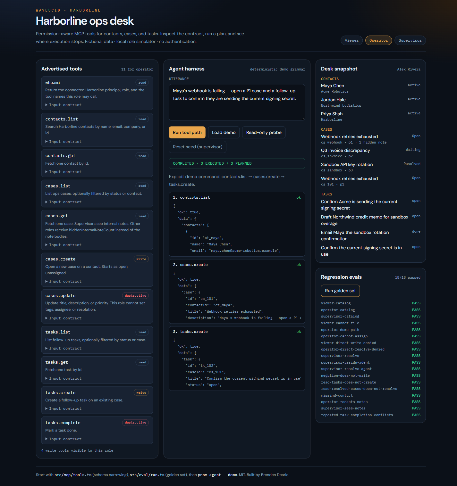
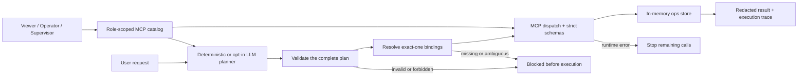

# WayLucid Agent MCP

**A permission-aware MCP server and agent harness that validates an entire plan before execution, narrows each role's tool surface, and records every step.**

[](https://github.com/brendendearie/waylucid-agent-mcp/actions/workflows/ci.yml)
[](package.json)
[](.github/workflows/ci.yml)
[](tsconfig.json)
[](LICENSE)

Harborline is a fictional operations desk built to make agent boundaries visible. It combines a real MCP server, role-scoped tools, a deterministic agent harness, optional OpenAI and Anthropic planners, an interactive React playground, and repeatable regression evidence.

**[125 automated tests](docs/VERIFICATION.md) · 18/18 eval scenarios · 66/66 assertions · Windows and Linux CI · zero known vulnerabilities at the recorded audit**

Built by **[Brenden Dearie](https://www.linkedin.com/in/brendendearie/)** · [GitHub](https://github.com/brendendearie)



## See the boundary

The same request completes for an operator and stops before the first call for a viewer:

```text
$ pnpm agent --role operator --demo
role=operator  planner=mock  outcome=completed
ok  contacts.list
ok  cases.create
ok  tasks.create

$ pnpm agent --role viewer --demo
role=viewer  planner=mock  outcome=blocked
denied (not advertised): cases.create, tasks.create
TOOL_NOT_ALLOWED: Dropped cases.create, tasks.create because role=viewer does not advertise them. No part of this workflow will execute.
```

That behavior is enforced across discovery, input schemas, dispatch, result redaction, and whole-plan validation. The enforcement lives in code at each boundary.

## What it demonstrates

| Control | Executable behavior | Evidence |
| --- | --- | --- |
| Role-scoped discovery | Viewer, operator, and supervisor receive different MCP tool catalogs | Catalog and direct forbidden-call tests |
| Least-privilege inputs | Tool schemas remove fields a role cannot write; operator cannot submit supervisor-only tags | Schema rejection plus unchanged-state assertions |
| Whole-plan preflight | Every planned call is validated before any call executes | Malformed later steps prevent earlier writes |
| Safe result binding | A lookup must return exactly one record before a dependent write can use its ID | Missing and ambiguous lookup regressions |
| Data redaction | Internal note bodies are only returned to supervisors | Protocol and snapshot tests |
| Failure containment | Execution stops after the first runtime error and reports remaining skipped steps | Dependency and repeated-action fixtures |
| Local transport guards | Playground binds to loopback and validates Host, Origin, role headers, and body size | Real HTTP and Streamable HTTP MCP tests |
| Auditable output | Human-readable transcripts, JSON traces, JUnit, and eval reports use explicit outcomes | CLI and CI artifact checks |

## Architecture



Authorization and intent are checked separately. A role may be allowed to create a case while a particular request, such as “Do not open a case for Maya,” must still produce no write.

## Quick start

Requires **Node 22.12+ on the 22.x line, Node 24.x, or Node 26+**, plus **pnpm 11.19.0**. The default demo needs no database, account, or API key.

```sh
git clone https://github.com/brendendearie/waylucid-agent-mcp.git
cd waylucid-agent-mcp
pnpm install --frozen-lockfile
pnpm check
pnpm playground
```

Open **http://127.0.0.1:43123** and run the operator demo. Switch to viewer and run the same request to see the plan blocked. Then try the read-only probe and run the eval panel.

The playground uses fictional data and a local role simulator. See the [security scope](docs/SECURITY.md) before adapting it to another system.

## Try the failure modes

```sh
# Successful three-call workflow with a machine-readable trace.
pnpm agent --role operator --demo --json

# Forbidden workflow; exits nonzero and performs no calls.
pnpm agent --role viewer --demo

# Read-only despite the phrase "follow-up".
pnpm agent --role viewer "list follow-up tasks"

# Conservative refusal; state remains unchanged.
pnpm agent "Do not open a case for Maya"

# Inspect exactly what a role can discover.
pnpm tools --role viewer --json

# Run the deterministic behavioral suite.
pnpm eval
pnpm eval --json
```

Use `pnpm agent --help` for supported options. Unknown, duplicate, and conflicting options are rejected before planning. Blocked and failed JSON runs preserve nonzero exit codes for automation.

## Permission matrix

| Capability | Viewer | Operator | Supervisor |
| --- | :---: | :---: | :---: |
| Discover and call contact/case/task reads | ✓ | ✓ | ✓ |
| Create cases and tasks; complete tasks | — | ✓ | ✓ |
| Update case title, description, and priority | — | ✓ | ✓ |
| Update case tags | — | — | ✓ |
| Assign or resolve cases; add internal notes; change contact status | — | — | ✓ |
| Read internal note bodies | — | — | ✓ |
| Reset the demo desk | — | — | ✓ |

All demo data is shared within one playground process and disappears when it stops. Separate CLI runs start from the seed.

## Verification

```sh
pnpm install --frozen-lockfile
pnpm typecheck
pnpm test       # includes real stdio and Streamable HTTP MCP round trips
pnpm eval       # deterministic planner and permission regressions
pnpm build      # compiles the React playground
pnpm audit
```

The current recorded run includes:

- **125 tests across 11 files**, including protocol, transport, permission, CLI, and state-invariance checks.
- **18/18 deterministic eval scenarios and 66/66 assertions** covering catalogs, writes, denials, redaction, ambiguity, negation, and runtime conflicts.
- **Four hosted CI targets:** Windows and Linux with Node 22 and 24.
- **A frozen 173-package dependency graph** and zero known vulnerabilities at the recorded audit.
- **An interactive browser walkthrough** at desktop and 390px mobile width, with no horizontal page overflow or console warnings.

Read the [verification record](docs/VERIFICATION.md) for exact scope and receipts. GitHub Actions uploads JUnit and JSON eval artifacts for each matrix job.

## Connect an MCP host

Run `pnpm mcp` as a stdio command from the repository directory. Set `WAYLUCID_ROLE` to `viewer`, `operator`, or `supervisor`; start with `viewer` for a read-only catalog. Protocol traffic stays on stdout and diagnostics go to stderr.

The playground also exposes Streamable HTTP at `/mcp`. Its `x-waylucid-role` header selects a demo role. Missing HTTP roles default to viewer and invalid roles are rejected.

## Optional live planning

The planner defaults to `mock`, even when provider keys exist in the environment. Live planning requires an explicit provider:

```sh
# Choose one provider and export its matching API key.
WAYLUCID_LLM=openai pnpm agent "list open cases"
WAYLUCID_LLM=anthropic pnpm agent "list open cases"
```

Model and environment options are documented in [`.env.example`](.env.example). Live providers receive the request and advertised tool catalog; their returned plan still passes through the same local validation and execution boundaries. The browser playground always uses the deterministic planner.

## Design scope

- The role selector demonstrates authorization after a role is chosen; it does not verify identity.
- The store is in memory and has no tenancy, durable audit log, rate limiting, or distributed concurrency.
- A later runtime failure stops subsequent calls but does not roll back earlier successful writes.
- The planner is one-shot. Deterministic evals establish the checked behaviors, not general model accuracy.
- Consequential production actions still need application-enforced confirmation and scoped credentials.

See [design decisions](docs/DESIGN.md), [security scope](docs/SECURITY.md), and the [demo walkthrough](docs/DEMO.md).

## Code map

| Start here | Why it matters |
| --- | --- |
| [`src/mcp/tools.ts`](src/mcp/tools.ts) | Role-specific tool registration, schemas, annotations, and redaction |
| [`src/auth.ts`](src/auth.ts) | Permission matrix and fictional principals |
| [`src/harness/validation.ts`](src/harness/validation.ts) | Whole-plan schema and dependency validation |
| [`src/harness/run.ts`](src/harness/run.ts) | Binding, execution, failure handling, and traces |
| [`src/eval/run.ts`](src/eval/run.ts) | Executable behavioral expectations |
| [`src/web/`](src/web/) | Loopback playground and HTTP boundary |
| [`tests/`](tests/) | Protocol, permission, adversarial, CLI, and transport evidence |

MIT · [Contributing](CONTRIBUTING.md)
