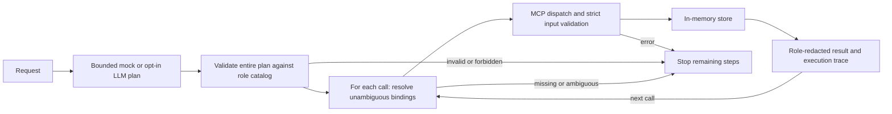

# WayLucid Agent MCP

**An executable reference for agents that know their permissions—and stop when a plan is unsafe to execute.**

Harborline is a fictional operations desk with contacts, cases, and tasks. Switch between viewer, operator, and supervisor: the MCP tool catalog changes, writable fields narrow, and internal notes are redacted. A small agent harness validates plans against that catalog before execution.

Built by [Brenden Dearie](https://github.com/brendendearie). TypeScript · MCP v2 · React · deterministic regression evals.


## Run it in five minutes

Requires **Node 22.12+ on the 22.x line, or Node 24.x**, and **pnpm 11.19.0** (pinned in `package.json`). No database, account, or API key needed.

```sh
git clone https://github.com/brendendearie/waylucid-agent-mcp.git
cd waylucid-agent-mcp
pnpm install --frozen-lockfile
pnpm check
pnpm playground
```

Open **http://127.0.0.1:43123**. Run the operator demo, switch to viewer and try it again, then try `list follow-up tasks`. The last prompt must only read the desk.

The playground is a **local role simulator, not an authentication system**. Do not expose it to the internet or load real customer records. [Security boundaries](docs/SECURITY.md).

## The engineering question

An agent can be authorized to create a case and still be wrong to create one. This reference treats these as separate checks:



| Boundary | Implementation | Evidence |
| --- | --- | --- |
| What the agent can discover | Role-specific tool registration | Catalog and direct forbidden-call tests |
| What fields it can submit | Strict schemas; supervisor-only `tags` on `cases.update` | Unauthorized fields fail without changing state |
| What it can read | Note-body redaction in tools and snapshots | Viewer/operator redaction tests |
| Whether a plan is executable | Whole-plan validation, exact-one bindings, stop-on-error | Malformed-plan, ambiguity, dependency and no-write regressions |
| Whether the demo stays local | Loopback binding, Host/Origin checks, bounded request bodies | Real HTTP boundary tests |

Schemas help a model choose valid actions; they cannot prevent a model from inventing a forbidden call. Enforcement belongs on the server. Tool annotations are hints, not approval controls.

## Try the boundary

```sh
# Expected: one P1 case and one linked follow-up task.
pnpm agent --demo

# Machine-readable trace; blocked and failed workflows still exit nonzero.
pnpm agent --demo --json

# Expected: blocked; no part of the write workflow executes. Exits nonzero.
pnpm agent --role viewer --demo

# Expected: read-only, even though "follow-up" appears in the request.
pnpm agent "list follow-up tasks"

# Expected: blocked and unchanged state. Exits nonzero.
pnpm agent "Do not open a case for Maya"

# Catalogs, successful workflows, negative cases, and state invariants.
pnpm eval
pnpm eval --json
```

Use `pnpm agent --help` for supported options. Unknown, duplicate, or conflicting options are rejected before execution; there is no `--dry-run` flag. Use the read-only viewer role or inspect a catalog with `pnpm tools --role viewer --json` when exploring.

See the [demo walkthrough](docs/DEMO.md) for a short screen-share script and the [design decisions](docs/DESIGN.md) for tradeoffs and production gaps.

## Permission matrix

| Capability | Viewer | Operator | Supervisor |
| --- | :---: | :---: | :---: |
| `whoami`, contact/case/task reads | ✓ | ✓ | ✓ |
| Create cases/tasks; complete tasks | — | ✓ | ✓ |
| Update case title, description, priority | — | ✓ | ✓ |
| Update case tags | — | — | ✓ |
| Assign/resolve cases; add internal notes; change contact status | — | — | ✓ |
| Read internal note bodies | — | — | ✓ |
| Reset the demo desk | — | — | ✓ |

All data is shared within one playground process and disappears when it stops. Separate CLI runs start from the seed.

## Verification you can reproduce

```sh
pnpm typecheck
pnpm test       # includes an actual stdio client/server round trip
pnpm eval       # deterministic mock-planner regression fixtures
pnpm build      # compile the playground assets
```

[`ci.yml`](.github/workflows/ci.yml) defines those gates on Windows/Linux and Node 22/24, with frozen dependencies and downloadable test/eval reports. Check [Actions](https://github.com/brendendearie/waylucid-agent-mcp/actions/workflows/ci.yml) for actual remote results; the workflow definition alone is not evidence of a passing hosted run.

The evals demonstrate the checked fixtures—not general model reliability, prompt-injection immunity, or production readiness. Optional live-provider contracts are tested with mocked responses; running the default suite makes no paid model calls.

[Recorded local verification](docs/VERIFICATION.md): 125 tests, 18 fixtures / 66 assertions, typecheck and UI build passed. Re-run against your checkout; this is a dated result, not a permanent badge.

## Connect an MCP host

Use `pnpm mcp` as a stdio command from this repository directory. Set `WAYLUCID_ROLE` to `viewer`, `operator`, or `supervisor`; use `viewer` for an initial read-only tour. Stdio protocol traffic stays on stdout; diagnostic logs go to stderr. The harness itself uses an in-process Streamable HTTP client against the same server factory.

The playground also exposes `/mcp`. Its `x-waylucid-role` header is an intentional **demo selector**, never a verified identity. Missing HTTP roles default to viewer; invalid roles are rejected.

## Optional live planning

The default is always `mock`, even when API keys exist in your shell. Explicitly select `WAYLUCID_LLM=openai` with `OPENAI_API_KEY`, or `WAYLUCID_LLM=anthropic` with `ANTHROPIC_API_KEY`. Model overrides are documented in [`.env.example`](.env.example); export variables in your shell (the CLI does not automatically load that file).

This is a **one-shot planner plus deterministic executor**, not a feedback-driven reasoning loop. Live providers receive the utterance and advertised catalog. Their plans still face local validation. Keep prompts synthetic and review costs before enabling them. The browser playground always uses the deterministic planner.

## Read the implementation

| Start here | Why it matters |
| --- | --- |
| [`src/mcp/tools.ts`](src/mcp/tools.ts) | Role-specific schemas and tool contracts |
| [`src/auth.ts`](src/auth.ts) | Explicit permission matrix and demo principals |
| [`src/harness/`](src/harness/) | Plan validation, binding, execution, failure reporting |
| [`src/eval/run.ts`](src/eval/run.ts) | Executable behavioral expectations |
| [`src/web/`](src/web/) | Local transport boundary |
| [`tests/`](tests/) | Protocol-level and adversarial regression evidence |

MIT · [Contributing](CONTRIBUTING.md)
