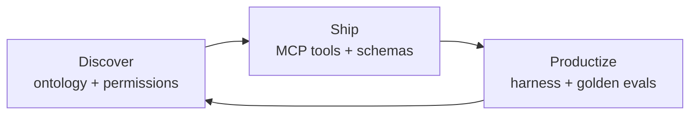
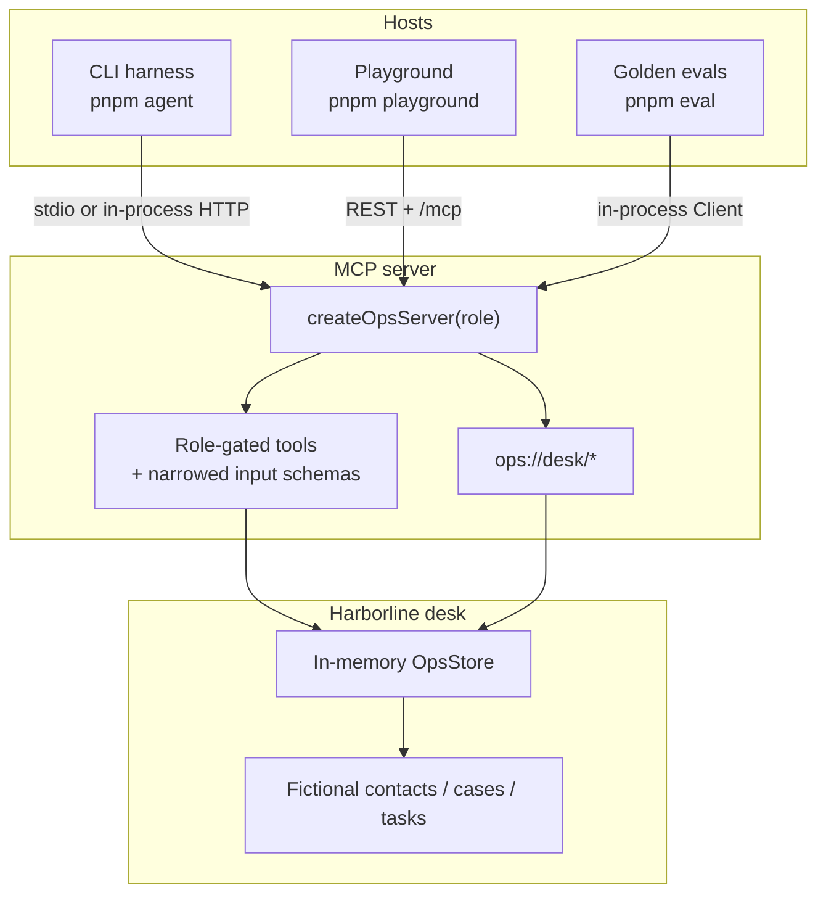

# waylucid-agent-mcp

Permission-aware MCP tools, a small agent harness, and CI evals for an ops desk.

Harborline is fictional seed data. The point is the shape: discover an ontology, ship it as MCP tools the model can actually see, and productize the boundary with evals.

Built by **Brenden Dearie**.

## Start here

1. **`src/mcp/tools.ts`** — tools are the product surface. The catalog is role-gated. `cases.update` is a *different schema* for operator vs supervisor, so the model cannot plan a field it is not allowed to send. The handler still enforces the matrix.
2. **`src/auth.ts` + `src/seed.ts`** — contacts / cases / tasks, plus data-plane redaction: operators get `hiddenInternalNoteCount`, supervisors get the note body.
3. **`src/eval/run.ts`** — a golden set that fails if a write leaks into the viewer catalog, if the demo path stops creating a P1 case, or if internal notes spill.
4. Run `pnpm agent --demo` then `pnpm eval`. That is the whole loop.

Quick check: switch the playground role from operator to viewer and run the same utterance. Create disappears from the plan.

## Discovery → ship → productize



| Stage | What we actually did here |
| --- | --- |
| **Discover** | Three objects an ops desk already has: contacts, cases, tasks. Three roles: viewer, operator, supervisor. Write down what each role must *never* do — assign, resolve, freeze an account, read internal notes — before writing a tool. |
| **Ship** | A TypeScript MCP server (`@modelcontextprotocol/server` v2) that advertises a coherent toolset over stdio and Streamable HTTP. Schemas are narrowed per role. Resources expose `ops://desk/whoami` and the catalog. Backing store is in-memory so this repo runs without a database or a paid API. |
| **Productize** | A harness that plans against the *advertised* catalog, not against a hidden admin API. A golden eval script that belongs in CI. A playground so you can exercise the desk without wiring Cursor or Claude Desktop first. |

The interesting failure mode for agent products is not “the model can’t call tools.” It is “the model planned a privileged write because the tool list lied.” This repo treats that as the product bug.

## Architecture



Stdio is what Cursor / Claude Desktop / MCP Inspector spawn. The harness tests use `createMcpHandler` + `StreamableHTTPClientTransport` with `fetch` pointed at the handler — no socket, same factory you would deploy.

## Permission matrix

| Tool | viewer | operator | supervisor |
| --- | --- | --- | --- |
| `whoami`, `*.list`, `*.get` | yes | yes | yes |
| `cases.create`, `cases.update`*, `tasks.create`, `tasks.complete` | — | yes | yes |
| `cases.assign`, `cases.resolve`, `cases.add_internal_note`, `contacts.update_status` | — | — | yes |
| Internal note bodies on `cases.get` | hidden | hidden | visible |

\*Operator `cases.update` accepts `title` / `description` / `priority`. Supervisor `cases.update` also accepts `tags`. Assignment and resolve stay on their own tools so a host can attach a confirmation to the destructive ones (`destructiveHint` is set).

The server never relies on the client to filter. If a viewer calls `cases.create` anyway, the tool is not registered on that session and MCP returns a protocol-level "not found" — the model never gets a successful write.

## How to run locally

Node 20+ (22 is what CI uses). pnpm preferred; npm works.

```bash
pnpm install          # or npm install
pnpm tools            # start the MCP factory, list the operator catalog, exit
pnpm agent --demo     # list Maya → open P1 case → create follow-up
pnpm eval             # golden set; exit 0 when green
pnpm test             # vitest, including the golden set
pnpm playground       # http://127.0.0.1:43123
```

Role is `--role viewer|operator|supervisor` or `WAYLUCID_ROLE`.

```bash
pnpm agent --role viewer "Maya's webhook is failing — open a P1 case"
pnpm agent --role supervisor "assign Maya's webhook case to Priya and resolve it"
```

### MCP Inspector / Cursor

```bash
pnpm mcp
```

Point a host at `tsx src/mcp/stdio.ts` (or `pnpm mcp`). Set `WAYLUCID_ROLE` in the server env. Logs go to stderr; stdout is JSON-RPC.

The playground also serves Streamable HTTP at `POST /mcp` with `x-waylucid-role: operator`.

### Optional live model

Default planner is a deterministic mock. That is intentional: the product surface is the tool boundary, and screens should not depend on a vendor key.

```bash
export WAYLUCID_LLM=openai
export OPENAI_API_KEY=...
# or WAYLUCID_LLM=anthropic and ANTHROPIC_API_KEY
pnpm agent --demo
```

No key? The mock planner still runs the demo path and the evals still gate quality.

## Package layout

```
src/auth.ts              roles, advertised catalog, principals
src/ontology.ts          contacts / cases / tasks
src/store.ts             in-memory desk
src/seed.ts              Harborline fixtures
src/mcp/create-server.ts factory
src/mcp/tools.ts         permission-aware tool schemas
src/mcp/stdio.ts         stdio entry
src/mcp/session.ts       in-process Client used by harness + evals
src/harness/             mock planner, optional OpenAI/Anthropic, CLI
src/eval/                golden fixtures + runner
src/web/                 playground HTTP + /mcp
playground/              Vite + React UI
tests/                   store, permissions, protocol, harness, evals
```

`npm test` and `pnpm eval` are the two commands CI runs after typecheck.

## Scope

This is a small reference, not a framework: one ontology, one server, one harness, one eval set. The store is in-memory and the default planner is a mock so the repo runs without a database or vendor key.

For a production shape, bind the same factory to a real CRM, run the golden set against recorded traces, and keep the tool schemas as the source of truth for what an agent is allowed to do.

## License

MIT. See [CONTRIBUTING.md](CONTRIBUTING.md) for the bar on PRs.
